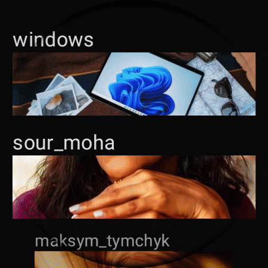

# Unsplash

Unsplash application for Android, Desktop and Web. Built using Kotlin Multiplatform and Compose with ❤️

👉 [Presentation][1]

## Set up the environment

You're going to need Android Studio (at least Arctic Fox version) with the KMM plugin installed.

### Running the apps

1. Clone the project locally

	git clone https://github.com/cmota/Unsplash.git

2. Open project with Android Studio

3. Wait for project to synchronise

### Android

To compile and install the Android application run:

	./gradlew androidApp:installDebug
	
### Android Wear

To compile and install the Android Wear application run::

	./gradlew androidWearApp:installDebug

### Desktop

To compile and install the Desktop application run:

	./gradlew desktopApp:run

### Web

To compile and run the web application run:

	./gradlew webApp:jsBrowserRun

## Libraries
- [ktor][2]
- [kotlinx.serialization][3]
- [PreCompose][4]
- [Accompanist-Android][5]
- [Accompanist-Desktop][6]
- [Kamel][7]

## Screens

### Android

### Android Wear

### Desktop

### Web

[1]:	https://speakerdeck.com/cmota/an-android-a-desktop-and-a-web-developer-enter-in-a-bar
[2]:	https://github.com/ktorio/ktor
[3]:	https://github.com/Kotlin/kotlinx.serialization
[4]:	https://github.com/Tlaster/PreCompose/
[5]:	https://github.com/google/accompanist/
[6]:	https://github.com/Syer10/accompanist/
[7]:	https://github.com/alialbaali/Kamel/
